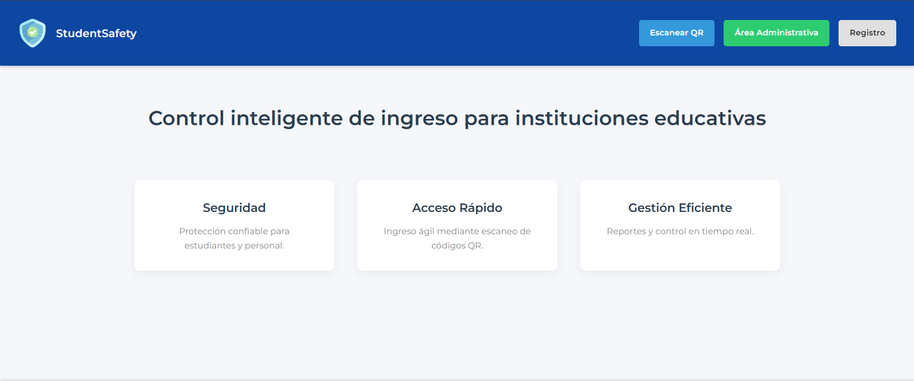
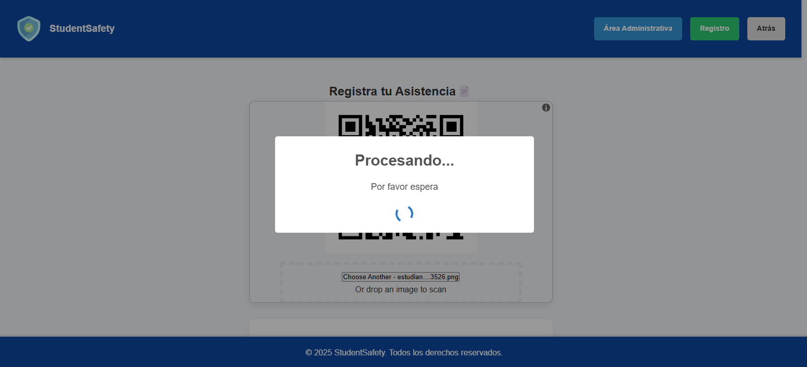
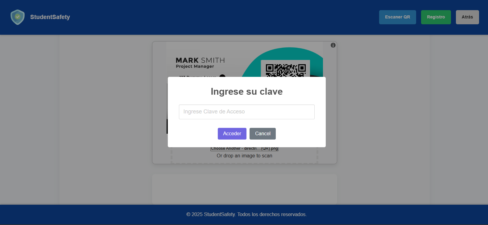
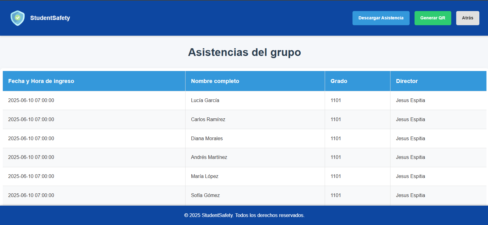
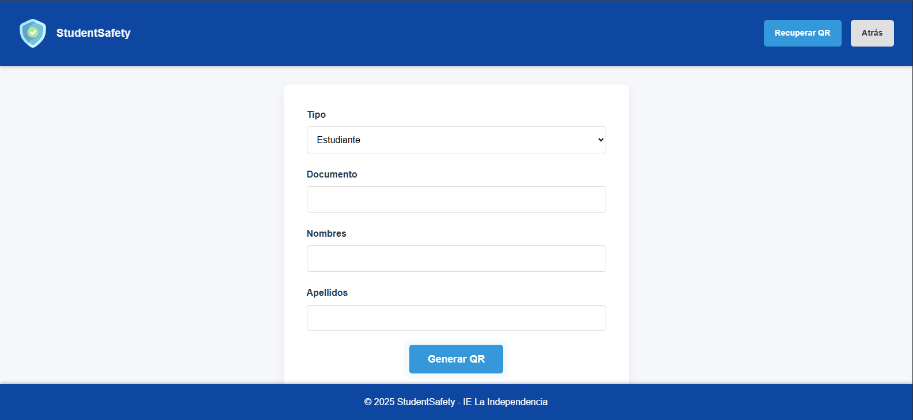
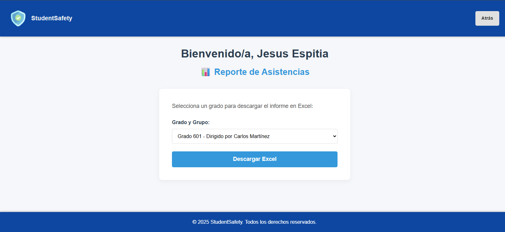

# PROBLEMATICA 🤔
La problemática del proyecto en la Institución Educativa La Independencia surge por la falta de un sistema automatizado y confiable para el control de ingreso y asistencia de los estudiantes, egresados y personal administrativo.
Actualmente, los registros se realizan de forma manual, lo que provoca retrasos, pérdida de información y dificultad para verificar la identidad de quienes ingresan o salen del plantel. Esta situación afecta la seguridad institucional y la organización de los datos, además de complicar el seguimiento de las citas o visitas que se realizan dentro de la institución.
Por eso, se crea el proyecto “student safety”, con el fin de ofrecer una solución tecnológica moderna y segura, que permita llevar un control preciso, rápido y ordenado mediante el uso de códigos QR y registros digitales.

===========================================================================

# 🧠 Base de Datos `student_safety_db`

## Descripción
La base de datos [**`student_safety_db`**](app/student_safety_db.sql) fue diseñada para un sistema de control de ingreso y asistencia institucional basado en **códigos QR**, utilizado por estudiantes, egresados y personal administrativo.  
Su objetivo es permitir un **registro automatizado, seguro y verificable** de cada persona que ingresa a la institución, con controles de acceso diferenciados y trazabilidad de las asistencias y citas. 
La base de datos soporta adecuadamente las funciones del sistema: control de acceso, trazabilidad y validación segura mediante QR y credenciales.

---

## 🧩 Estructura general
- tablas principales:

1. `DIRECTRICES`
2. `GRADO_GRUPO`
3. `PERSONAS`
4. `CITA`
5. `ASISTENCIA`

Estas tablas están relacionadas entre sí mediante **claves foráneas**, asegurando integridad referencial y permitiendo una relación jerárquica entre directivos, grupos, estudiantes y sus registros de ingreso.

---

##  1. Tabla `DIRECTRICES`

**Propósito:**  
Almacena los datos de las directrices o personal administrativo responsable de cada grupo y de la gestión de citas.

**Campos:**
- `id_directrices`: Clave primaria.
- `documento_directriz`: Documento único.
- `nombres_directriz`, `apellidos_directriz`: Datos personales.
- `cargo_directriz`: Rol institucional.
- `nota`: Campo opcional.
- `clave_directriz`: Contraseña del área administrativa.

---

##  2. Tabla `GRADO_GRUPO`

**Propósito:**  
Define los grupos académicos y los asocia con su directriz.

**Campos:**
- `id_grado_grado`: Clave primaria.
- `grado_grupo`: Identificador del grupo.
- `director_id`: Clave foránea a `DIRECTRICES(id_directrices)`.

---

##  3. Tabla `PERSONAS`

**Propósito:**  
Contiene estudiantes y egresados.

**Campos:**
- `id_personas`: Clave primaria.
- `documento_persona`: Documento único.
- `nombres_persona`, `apellidos_persona`: Datos personales.
- `tipo_personas`: ENUM('estudiante', 'egresado').
- `grado_grupo_id`: FK a `GRADO_GRUPO(id_grado_grado)`.

---

##  4. Tabla `CITA`

**Propósito:**  
Registra las citas entre directrices y personas.

**Campos:**
- `id_cita`: Clave primaria.
- `fechaHora_cita`: Fecha y hora.
- `motivo_cita`: Descripción.
- `directrizEncargado_id`: FK a `DIRECTRICES`.
- `personaCitada_id`: FK a `PERSONAS`.

---

##  5. Tabla `ASISTENCIA`

**Propósito:**  
Registra cada ingreso mediante QR.

**Campos:**
- `id_asistencia`: Clave primaria.
- `fechaHora`: Momento del registro.
- `nombres_asistencia`, `apellidos_asistencia`: Datos del ingreso.
- `persona_id`: FK hacia `PERSONAS(documento_persona)`.

---

##  Relaciones

| Relación | Tipo | Descripción |
|-----------|------|-------------|
| DIRECTRICES → GRADO_GRUPO | 1:N | Una directriz puede dirigir varios grupos |
| GRADO_GRUPO → PERSONAS | 1:N | Un grupo puede tener muchos estudiantes |
| PERSONAS → ASISTENCIA | 1:N | Una persona puede registrar muchas asistencias |
| DIRECTRICES → CITA | 1:N | Una directriz puede tener muchas citas |
| PERSONAS → CITA | 1:N | Una persona puede tener varias citas |

---

## Consideraciones y mejoras

1. **Redundancia controlada:**  
   `ASISTENCIA` Repite nombres por eficiencia y seguridad. La redundancia de nombres acelera las operaciones de inserción.
   `ASISTENCIA` Falta claridad en el uso de la tabla.

2. **Posibles mejoras:**  
   - Usar UUIDs.  
   - Tabla `USUARIOS` para unificar tipos.  
   - Tabla `ROL` para permisos.  
   - Índices en `documento_persona` y `fechaHora`.

===========================================================================

# HERRAMIENTAS Y PROGRAMAS REQUERIDOS (INSTALACION) 📚

## 🐍 1. INSTALAR PYTHON (con PATH y funciones)
- Paso 1: Descargar

Ve a 👉 https://www.python.org/downloads/

Descarga la versión más reciente 

- Paso 2: Instalar

Abre el instalador.

MUY IMPORTANTE: marca la casilla que dice
✅ “Add Python 3.x to PATH”

Haz clic en Install Now.

Espera a que termine y cierra.

---

## 💻 2. INSTALAR VISUAL STUDIO CODE (VS Code con Python)
- Paso 1: Descargar

👉 https://code.visualstudio.com/

- Paso 2: Instalar

Durante la instalación marca estas casillas:
✅ Add to PATH
✅ Register Code as an editor for supported file types
✅ Add “Open with Code” to right-click menu

Luego haz clic en Next → Install.

- Paso 3: Instalar la extensión de Python

Abre VS Code.

En el lado izquierdo, haz clic en el ícono de extensiones (cuadrito con esquinas).

Busca “Python” y selecciona la que diga Microsoft.

Presiona Instalar.
✅ ¡Listo!

- Paso 4: Vincular Python con VS Code

Abre un archivo .py.

En la parte inferior derecha, haz clic en Seleccionar intérprete.

Elige el Python que instalaste (Python 3.12 (C:\Users\...Python3x\python.exe) ).

---

## 🧩 3. INSTALAR GIT (y configurarlo)
- Paso 1: Descargar

👉 https://git-scm.com/downloads

- Paso 2: Instalar

Durante la instalación:

Deja casi todo por defecto.

Cuando aparezca la opción “Adjusting your PATH environment”, selecciona:
✅ “Git from the command line and also from 3rd-party software”

Continúa hasta el final y termina la instalación.

- Paso 3: Verificar

Abre CMD o PowerShell:

1. git --version
2. git config --global user.name "Tu Nombre"
3. git config --global user.email "tucorreo@example.com"

---

# 🧱 4. INSTALAR XAMPP (revisar puertos)
- Paso 1: Descargar

👉 https://www.apachefriends.org/es/index.html

- Paso 2: Instalar

Abre el instalador.

Deja seleccionados Apache, MySQL, PHP, y phpMyAdmin.

Instala normalmente.

Al terminar, abre el XAMPP Control Panel.

- Paso 3: Encender servicios

En el panel, presiona:

Start en Apache

Start en MySQL

Ambos deben mostrar “Running” en verde ✅.

- Paso 4: Verificar puertos

Por defecto:

Apache usa el puerto 80

MySQL usa el puerto 3306

Si alguno no arranca, probablemente el puerto está ocupado.

Para revisar, abre CMD y escribe:

netstat -ano | findstr :80
netstat -ano | findstr :3306

~**Si aparece un número de PID, significa que otro programa usa ese puerto.**~

- Paso 5: Cambiar el puerto (si es necesario)

Si Apache no arranca:

En XAMPP, haz clic en Config → Apache (httpd.conf).

Busca Listen 80 y cámbialo por Listen 8080.

Busca ServerName localhost:80 y cambia por ServerName localhost:8080.

Guarda y reinicia Apache.
Luego entra a:
👉 http://localhost:8080/

- Paso 6: Probar base de datos

Abre en el navegador:

http://localhost/phpmyadmin/

===========================================================================

# RUTAS 🌐
- ### RUTAS RELEVANTES "No Interfaz":
    - "**/registrar_asistencia**" [Ruta para la busqueda de personas en la 'DB' y luego se registra su asistencia.](app/routes/qr_asistencia.py)
    - "**/verificar_directriz**"  [Ruta donde se verifica la existencia de un documento en el QR, Si el documento pertenece a un directriz. Guarda el nombre completo y devuelve una respuesta JSON:true](app/routes/admin_qr.py)
    - "**/verificar_clave**" [Ruta en donde se valida que el documento ingresado por QR coincide con uno ya existente en la 'BD'](app/routes/verificar_clave.py)
    - "**/api/grupo**" [Ruta "Experimetal" (No interfaz) Menús desplegables.](app/routes/ver_grupos.py)

- ### RUTAS RELEVANTES "Interfaz":
    - "**/**" [Ruta de inicio, Pagina principal.](app/templates/index.html) 
    
    - "**/escaner**" [Control de acceso (asistencia) para estudiantes.](app/templates/qr_asistencia.html)
    
    - "**/admin_qr**" [Ruta para acceder al panel de administrador con doble factor de autentificación](app/templates/admin_qr.html)
    
    - "**/admin_dashboard**" [Ruta para la interfaz del panel de administración, donde un administrador ingresa con su nombre desde el inicio de seccion. puede entrar, seleccionar y luego consultar las asitencias de los grupos en la 'BD'](app/templates/admin_dashboard.html)
    
    - "**/consultar_asistencias**" [Lista los grupos recibidos y busca las asistencias de esos grupos en la 'BD'](app/templates/asistencias_tabla.html)
    
    -"**/generador_qr**" [Ruta para registrar estudiantes y directrices nuevos en la 'BD', Generacion de QR personal por primera vez (12/09/2025 => Corregir inserccion en la BD de los estudiantes)](app/templates/generador_qr.html)
    
    - "**/reportes_asistencias**" [Consulta todo los grados y sus directores y muestra en la interfaz para que el administrador pueda elegir uno y descagar un excel con esta infromacion.](app/templates/reportes_asistencias.html)
    
