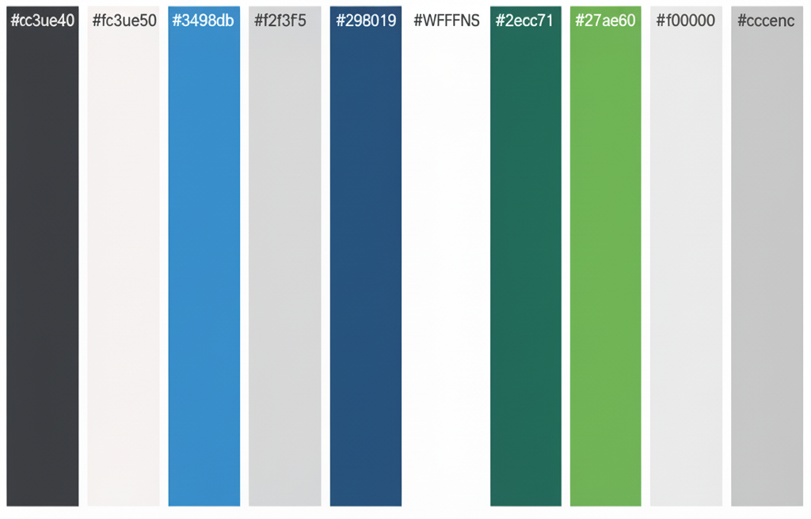
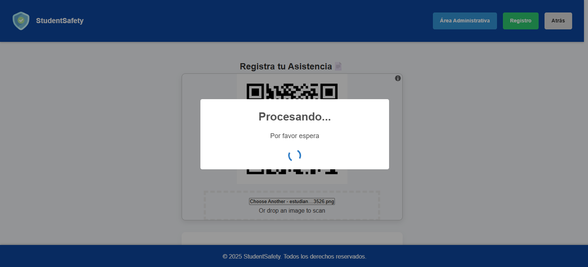
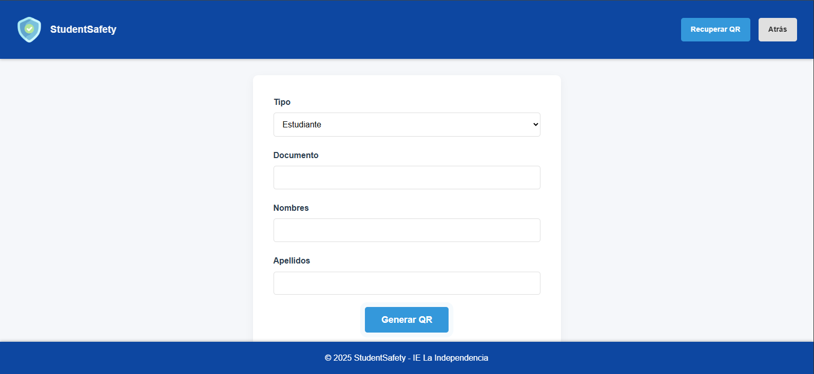
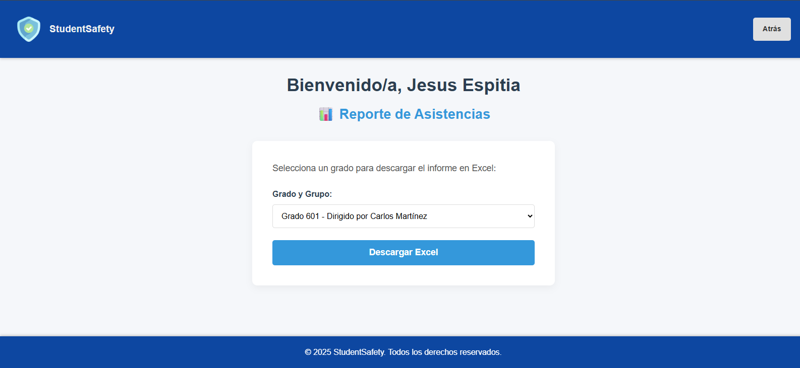

# PROBLEMATICA 🤔
La problemática del proyecto en la Institución Educativa La Independencia surge por la falta de un sistema automatizado y confiable para el control de ingreso y asistencia de los estudiantes, egresados y personal administrativo.
Actualmente, los registros se realizan de forma manual, lo que provoca retrasos, pérdida de información y dificultad para verificar la identidad de quienes ingresan o salen del plantel. Esta situación afecta la seguridad institucional y la organización de los datos, además de complicar el seguimiento de las citas o visitas que se realizan dentro de la institución.
Por eso, se crea el proyecto “student safety”, con el fin de ofrecer una solución tecnológica moderna y segura, que permita llevar un control preciso, rápido y ordenado mediante el uso de códigos QR y registros digitales.

===========================================================================


# 🧠 Base de Datos `student_safety_db`

## Descripción
La base de datos [**`student_safety_db`**](app/student_safety_db.sql) fue diseñada para un sistema de control de ingreso y asistencia institucional basado en **códigos QR**, utilizado por estudiantes, egresados y personal administrativo.  
Su objetivo es permitir un **registro automatizado, seguro y verificable** de cada persona que ingresa a la institución, con controles de acceso diferenciados y trazabilidad de las asistencias y citas. 
La base de datos soporta adecuadamente las funciones del sistema: control de acceso, trazabilidad y validación segura mediante QR y credenciales.

---

## üß© Estructura general
- tablas principales:

1. `DIRECTRICES`
2. `GRADO_GRUPO`
3. `PERSONAS`
4. `CITA`
5. `ASISTENCIA`

Estas tablas están relacionadas entre sí mediante **claves foráneas**, asegurando integridad referencial y permitiendo una relación jerárquica entre directivos, grupos, estudiantes y sus registros de ingreso.

---

##  1. Tabla `DIRECTRICES`

**Propósito:**  
Almacena los datos de las directrices o personal administrativo responsable de cada grupo y de la gestión de citas.

**Campos:**
- `id_directrices`: Clave primaria.
- `documento_directriz`: Documento √∫nico.
- `nombres_directriz`, `apellidos_directriz`: Datos personales.
- `cargo_directriz`: Rol institucional.
- `nota`: Campo opcional.
- `clave_directriz`: Contraseña del área administrativa.


---

##  2. Tabla `GRADO_GRUPO`

**Propósito:**  
Define los grupos académicos y los asocia con su directriz.

**Campos:**
- `id_grado_grado`: Clave primaria.
- `grado_grupo`: Identificador del grupo.
- `director_id`: Clave for√°nea a `DIRECTRICES(id_directrices)`.


---

##  3. Tabla `PERSONAS`

**Propósito:**  
Contiene estudiantes y egresados.

**Campos:**
- `id_personas`: Clave primaria.
- `documento_persona`: Documento √∫nico.
- `nombres_persona`, `apellidos_persona`: Datos personales.
- `tipo_personas`: ENUM('estudiante', 'egresado').
- `grado_grupo_id`: FK a `GRADO_GRUPO(id_grado_grado)`.


---

##  4. Tabla `CITA`

**Propósito:**  
Registra las citas entre directrices y personas.

**Campos:**
- `id_cita`: Clave primaria.
- `fechaHora_cita`: Fecha y hora.
- `motivo_cita`: Descripción.
- `directrizEncargado_id`: FK a `DIRECTRICES`.
- `personaCitada_id`: FK a `PERSONAS`.

---

##  5. Tabla `ASISTENCIA`

**Propósito:**  
Registra cada ingreso mediante QR.

**Campos:**
- `id_asistencia`: Clave primaria.
- `fechaHora`: Momento del registro.
- `nombres_asistencia`, `apellidos_asistencia`: Datos del ingreso.
- `persona_id`: FK hacia `PERSONAS(documento_persona)`.

---

##  Relaciones

| Relación | Tipo | Descripción |
|-----------|------|-------------|
| DIRECTRICES ‚Üí GRADO_GRUPO | 1:N | Una directriz puede dirigir varios grupos |
| GRADO_GRUPO ‚Üí PERSONAS | 1:N | Un grupo puede tener muchos estudiantes |
| PERSONAS ‚Üí ASISTENCIA | 1:N | Una persona puede registrar muchas asistencias |
| DIRECTRICES ‚Üí CITA | 1:N | Una directriz puede tener muchas citas |
| PERSONAS ‚Üí CITA | 1:N | Una persona puede tener varias citas |

---

## Consideraciones y mejoras

1. **Redundancia controlada:**  
   `ASISTENCIA` Repite nombres por eficiencia y seguridad. La redundancia de nombres acelera las operaciones de inserción.
   `ASISTENCIA` Falta claridad en el uso de la tabla.

2. **Posibles mejoras:**  
   - Usar UUIDs.  
   - Tabla `USUARIOS` para unificar tipos.  
   - Tabla `ROL` para permisos.  
   - Índices en `documento_persona` y `fechaHora`.


===========================================================================

# HERRAMIENTAS Y PROGRAMAS REQUERIDOS (INSTALACIÓN) 📚

---

## üêç 1. INSTALAR PYTHON (con PATH y funciones)

### Paso 1: Descargar
Ve a üëâ [https://www.python.org/downloads/](https://www.python.org/downloads/)  
Descarga la versión más reciente.

### Paso 2: Instalar
Abre el instalador.  

**MUY IMPORTANTE:** marca la casilla que dice:  
‚úÖ `Add Python 3.x to PATH`

Haz clic en **Install Now**.  
Espera a que termine y cierra.

---

## 💻 2. INSTALAR VISUAL STUDIO CODE (VS Code con Python)

### Paso 1: Descargar
üëâ [https://code.visualstudio.com/](https://code.visualstudio.com/)

### Paso 2: Instalar
Durante la instalación marca estas casillas:  
‚úÖ Add to PATH  
‚úÖ Register Code as an editor for supported file types  
✅ Add “Open with Code” to right-click menu  

Luego haz clic en **Next ‚Üí Install**.

### Paso 3: Instalar la extensión de Python
1. Abre **VS Code**.  
2. En el lado izquierdo, haz clic en el ícono de **extensiones** (cuadrito con esquinas).  
3. Busca **"Python"** y selecciona la que diga **Microsoft**.  
4. Presiona **Instalar**.  
‚úÖ ¬°Listo!

### Paso 4: Vincular Python con VS Code
1. Abre un archivo `.py`.  
2. En la parte inferior derecha, haz clic en **Seleccionar intérprete**.  
3. Elige el Python que instalaste (por ejemplo: `Python 3.12 (C:\Users\...Python3x\python.exe)`).

---

## üß© 3. INSTALAR GIT (y configurarlo)

### Paso 1: Descargar
üëâ [https://git-scm.com/downloads](https://git-scm.com/downloads)

### Paso 2: Instalar
Durante la instalación:  
Deja casi todo por defecto.  

Cuando aparezca la opción **“Adjusting your PATH environment”**, selecciona:  
✅ “Git from the command line and also from 3rd-party software”

Continúa hasta el final y termina la instalación.

### Paso 3: Verificar
Abre **CMD o PowerShell** y escribe:

```bash
git --version
git config --global user.name "Tu Nombre"
git config --global user.email "tucorreo@example.com"
```

---

## 🧰 4. INSTALAR LAS LIBRERÍAS DE PYTHON

Una vez finalizado todo el proceso anterior, se deben instalar las **librerías de Python** necesarias para el correcto funcionamiento del código.

1. Abre **Visual Studio Code**.  
2. Presiona las teclas **Ctrl + J** para abrir la **terminal integrada**.  
3. Verifica que la ruta sea similar a:  
   ```
   PS C:\Users\YO\Downloads\repo\studentsafety\app>
   ```
   Si en la √∫ltima parte **no aparece "app"**, ingresa con el siguiente comando:
   ```bash
   cd app
   ```
4. Cuando estés dentro de la carpeta `app`, ejecuta el siguiente comando:
   ```bash
   pip install -r requirements.txt
   ```
   Esto instalará todas las librerías listadas en el archivo `requirements.txt`.

---

## üß± 5. CONFIGURAR LA BASE DE DATOS EN PHPMYADMIN

1. Abre tu navegador y entra en:  
   üëâ [http://localhost/phpmyadmin/](http://localhost/phpmyadmin/)
2. En la parte superior derecha, haz clic en la opción **“SQL”**.  
3. Abre el archivo llamado [**`student_safety_db`**](app/student_safety_db.sql), copia su contenido y pégalo en el editor SQL de phpMyAdmin.  
4. Ejecuta el script de una de las siguientes formas:
   - Haciendo clic en el botón **“Continuar”** (ubicado en la parte inferior derecha).  
   - O presionando **Ctrl + Enter** desde el teclado.

‚úÖ Con esto, tu entorno de desarrollo y la base de datos quedar√°n correctamente configurados.

===========================================================================
# HERRAMIENTAS, ICONOS, IMAGENES ETC... ⚙️🖼️🎞️

## Paleta de colores



--- 

## Icono del proyecto "**student safety**"


===========================================================================


# RUTAS üåê
- ### RUTAS RELEVANTES "No Interfaz":
    - "**/registrar_asistencia**" [Ruta para la busqueda de personas en la 'DB' y luego se registra su asistencia.](app/routes/qr_asistencia.py)
    - "**/verificar_directriz**"  [Ruta donde se verifica la existencia de un documento en el QR, Si el documento pertenece a un directriz. Guarda el nombre completo y devuelve una respuesta JSON:true](app/routes/admin_qr.py)
    - "**/verificar_clave**" [Ruta en donde se valida que el documento ingresado por QR coincide con uno ya existente en la 'BD'](app/routes/verificar_clave.py)
    - "**/api/grupo**" [Ruta "Experimetal" (No interfaz) Men√∫s desplegables.](app/routes/ver_grupos.py)

- ### RUTAS RELEVANTES "Interfaz":
    - "**/**" [Ruta de inicio, Pagina principal.](app/templates/index.html) 
    
    - "**/escaner**" [Control de acceso (asistencia) para estudiantes.](app/templates/qr_asistencia.html)
    
    - "**/admin_qr**" [Ruta para acceder al panel de administrador con doble factor de autentificación](app/templates/admin_qr.html)
    
    - "**/admin_dashboard**" [Ruta para la interfaz del panel de administración, donde un administrador ingresa con su nombre desde el inicio de seccion. puede entrar, seleccionar y luego consultar las asitencias de los grupos en la 'BD'](app/templates/admin_dashboard.html)
    
    - "**/consultar_asistencias**" [Lista los grupos recibidos y busca las asistencias de esos grupos en la 'BD'](app/templates/asistencias_tabla.html)
    
    -"**/generador_qr**" [Ruta para registrar estudiantes y directrices nuevos en la 'BD', Generacion de QR personal por primera vez (12/09/2025 => Corregir inserccion en la BD de los estudiantes)](app/templates/generador_qr.html)
    
    - "**/reportes_asistencias**" [Consulta todo los grados y sus directores y muestra en la interfaz para que el administrador pueda elegir uno y descagar un excel con esta infromacion.](app/templates/reportes_asistencias.html)
    

===========================================================================

# 💾 RECOMENDACIONES DE MIGRACIÓN DE BASE DE DATOS Y ENTORNO

---

## 🗄️ Migración de la base de datos
Se recomienda **migrar la base de datos a SQL Server**, en cualquier versión disponible, para que se integre de una forma más precisa y eficiente en **entornos laborales**.

---

## ⚙️ Migración de la lógica y los lenguajes
La parte correspondiente a la **lógica de negocio y los lenguajes** debe migrarse hacia un **servidor de producción** con la capacidad adecuada para soportar las operaciones requeridas.

---

## üß™ Entornos de prueba
Se recomienda utilizar **entornos virtuales** para realizar pruebas y evitar afectar el entorno de producción.
